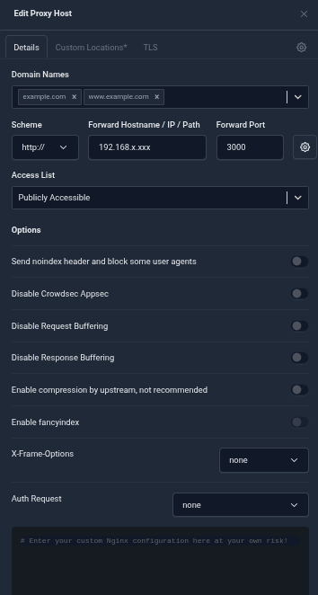
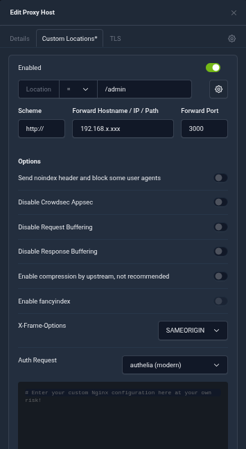

# The Firmament

A self-hosted homelab portal with an AI guardian 
character, live infrastructure metrics, and a 
fully configurable admin panel.


[](https://buymeacoffee.com/schrothdotca)

## Features

- AI guardian character with scroll-driven video animations
- Service card dashboard with full admin CRUD panel
- Four card styles: glassmorphism, solid, minimal, bordered
- Live Proxmox/InfluxDB node metrics in side panel
- Borg-UI backup status integration
- Authelia SSO forward auth integration
- Auth-gated and offline-detection service cards
- Configurable welcome modal (title, body, button text)
- Full theme system with presets, dual accent colours, colour pickers, font selector, card opacity
- Custom font upload (.woff2/.woff/.ttf) for heading, body, and mono slots
- ENGEL side panel with per-node and per-metric visibility controls
- Character blend mode, status overlay, and mobile panel visibility controls
- Mobile responsive
- Docker deployment

## Stack

- Node.js + Express
- SQLite (better-sqlite3)
- Vanilla HTML/CSS/JS
- Docker (two-stage build, ~400MB image)

## Services Dashboard


All configuration is done through the admin 
panel at `/admin` — protected by Authelia.

Configure services, categories, theme, 
metrics, backup status, and more without 
touching any code.

## Admin Panel

### Live Metrics


### Services & Categories


### Layout Settings


## Mobile

<details>
<summary>Mobile screenshot (click to expand)</summary>

</details>

The portal is fully responsive. On mobile 
the hero works as on desktop. The services 
section shows one card per row. The side 
panel can be shown or hidden on mobile 
via the admin panel.

## Requirements

- Docker + Docker Compose
- Authelia with a domain cookie and access rule for `/admin` (see Setup below)
- NPMplus (recommended — has built-in Authelia integration)
- NPM or nginx (supported but requires manual Authelia auth_request configuration)
- InfluxDB v2 with Proxmox metrics (optional)
- Borg-UI (optional)

## Setup

### 1. Authelia

Admin access is protected entirely at the proxy layer — no app-level auth is involved.

Add an access rule protecting `/admin` in `configuration.yml`:

```yaml
access_control:
  rules:
    - domain: yourdomain.com
      resources:
        - "^/admin.*$"
      policy: one_factor
```

Make sure your `session` cookies block uses the same domain:

```yaml
session:
  cookies:
    - domain: yourdomain.com
      authelia_url: https://auth.yourdomain.com
```

> **Subdomain installs:** If Firmament is on a subdomain (e.g. `demo.yourdomain.com`), do not add it to the `session.cookies` block — the parent domain cookie scope covers subdomains automatically and Authelia will refuse to start if you do. Just add the access rule for your subdomain and leave cookies as-is.

No changes to `.env` are needed for auth — Authelia config lives entirely in `configuration.yml`.

### 2. NPMplus

Authelia is applied only to `/admin` via a **Custom Location**, not to the whole domain.

**Details tab:** Set the forward hostname/IP and port 3000, scheme HTTP, Access List: Publicly Accessible, Auth Request: none.

**Custom Locations tab:** Add a location with path `= /admin`, forward to the same backend IP and port 3000, and set Auth Request to **authelia (modern)**. This locks `/admin` behind Authelia while leaving the rest of the portal public.

No custom Advanced config or manual `auth_request` directives are needed.

<table>
<tr>
<td><strong>Details tab</strong> — Auth Request: none on the main proxy host</td>
<td><strong>Custom Locations tab</strong> — Auth Request: authelia (modern) on the /admin location</td>
</tr>
<tr>
<td></td>
<td></td>
</tr>
</table>

### 3. Clone the repo

```bash
git clone https://github.com/bferd/the-firmament
cd the-firmament
cp .env.example .env
cp docker-compose.example.yml docker-compose.yml
```

### 4. Configure .env

Edit `.env` and fill in your values:
- `AUTHELIA_URL` — your Authelia instance IP and port
- `NPMPLUS_IP` — your NPMplus reverse proxy IP
- `BIND_IP` — your server IP

### 5. Configure docker-compose.yml

Update these values for your setup:

```yaml
ports:
  - "YOUR_SERVER_IP:3000:3000"  # Change to your server IP

environment:
  - AUTHELIA_URL=http://YOUR_AUTHELIA_IP:9091  # Your Authelia instance
  - NPMPLUS_IP=YOUR_NPMPLUS_IP                 # Your reverse proxy IP
```

The compose file expects these directories (bind mounts) without these uploads will be overwritten on restart:
- `./data/` — SQLite database (created automatically)
- `./videos/` — Character and background videos (add your own)
- `./fonts/` — Custom uploaded fonts (created automatically)
- `./public/` — Static assets

The app runs on port 3000 internally. Bind it to your server IP rather than 0.0.0.0 to avoid exposing it beyond your local network.

### 6. Add your videos

This repo does not include character videos.
Generate your own using Higgsfield.ai or 
similar AI video tools and place them in 
the `/videos` directory:

- `hero-welcome.webm` — plays once on load
- `hero-idle-loop.webm` — loops on hero
- `hero-transition.webm` — scroll trigger
- `hero-browse-idle.webm` — side panel loop
- `hero-background.mp4` — hero background

### 7. Build and start

```bash
sudo chown -R 1000:1000 data fonts videos public #the bind mounts in docker-compose.ymlinstructions above

docker compose up -d --build
```

> **Admin is only accessible through your reverse proxy at `https://yourdomain.com/admin` — direct IP:port access is blocked by design. Authelia forward auth is enforced at the proxy level.**

> **Note:** InfluxDB and Borg-UI tokens are configured through the admin panel at `/admin` — not in `.env`.

## Theming & Customization

Themes are fully configured through the admin panel — no CSS edits required for normal use. If you do customize the stylesheet directly, the primary and secondary accent colours use these CSS variables:

| Variable | Description |
|----------|-------------|
| `--accent` | Primary accent colour (maps to `theme_accent_primary`) |
| `--accent-rgb` | Comma-separated RGB of `--accent`, e.g. `0,229,255` |
| `--accent2` | Secondary accent colour (maps to `theme_accent_secondary`) |
| `--accent2-rgb` | Comma-separated RGB of `--accent2`, e.g. `139,92,246` |

These are set at runtime by `applyTheme()` in `main.js`. Use them in custom CSS as `rgba(var(--accent-rgb), 0.4)` rather than hardcoding hex values, so your additions stay theme-aware.

## Notes & Troubleshooting

### Proxmox Backup Server (PBS) node metrics

PBS nodes expose memory differently from standard PVE nodes. A PBS node reports memory as a **float percentage (0–100)** rather than used/total bytes. Similarly, disk usage for PBS represents **datastore usage in GB**, not raw bytes like LXC/QEMU containers.

To handle this correctly, add `"node_type": "pbs"` to the node mapping for any PBS node in the admin panel (Settings → InfluxDB → Node Mappings). PVE nodes do not need this field (it defaults to `"pve"`).

```json
{ "host": "proxmox-backup-server", "display": "PBS", "node_type": "pbs" }
```

Without this flag, PBS memory and disk values will be misread — memory will appear as a near-zero percentage and disk will be off by several orders of magnitude.

---

## License

MIT — see LICENSE file.

## Credits

Created by [Brad Schroth](https://linkstack.schroth.ca/@brad) — [schroth.ca](https://schroth.ca)
